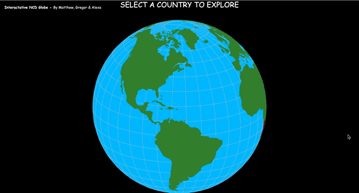
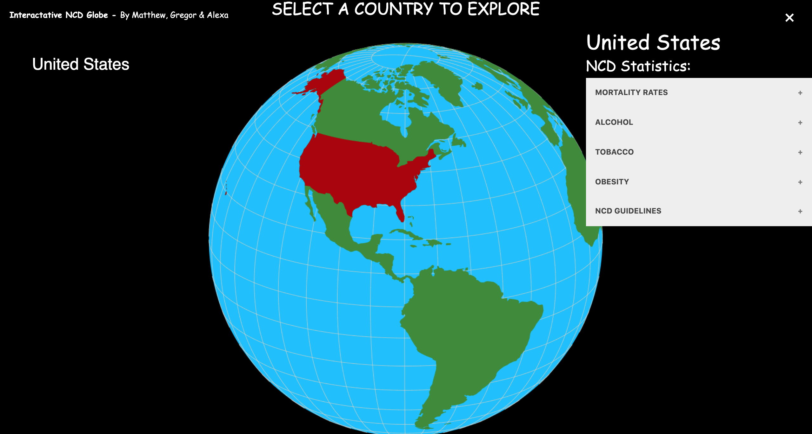

## HCI Project for University
Aimed to allow Users to check non-communicable disease (NCD) statistics for any country.

Interactive 3D Globe Design

### Created by Gregor, Matthew and Alexa
Technologies 
* React
* Angular
* Json
* HTML + CSS

